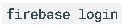
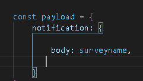

# FirebaseNotification
Notification for makesurvey application

 ## **Uygulamamızda Firebase Funcktion ve Cloud Messaging**
Firebase fonksiyon hizmetini kullana bilmek için Node.js kullandık. Node.js, JavaScript ile server side uygulamalar yazabileceğimiz, Joyent tarafından 2009 yılında geliştirilmeye başlanmış bir Javascript Runtime platformudur. Firebase fonksiyonları Node.js ortamında kullanabilmek için metodunu terminalde çağırırız.

*Node.js terminalden firebase eklenmesi

Fonksiyonları kullanabilmek için Node.js üstünden login oluyoruz.

* Node.js üstünden giriş yapma

Metodunu terminalde çağırıp Google hesabımızla giriş yaptık. 

* Firebase fonksiyon dosyası oluşturma

Metodunu terminalde çağırdık. Bu metot bize yazacağımız program hakkında sorular sorar. Örneğin kullanacağımız dili biz javascript dilini seçtik. İşlemler bittikten sonra bize hazır bir dosya gelir.  Functions klasörün altında index.js kodu altında fonksiyonlarımızı yazıyoruz.

* onCreate komutu

Şekildeki kod bloğunda tanımladığımız veri tabanı yoluna ne zaman bir veri eklenirse tetiklen komutu devreye girer. Ne zaman bir kullanıcı anket yanıtlarsa bu komut tetiklenir.

* Söz oluşturma

Bir söz oluşturulup veri tabanımızdan kullanıcının kendine ait jetonu alınır. Bu jeton uygulamamızın içinde olan MyFirebaseInstanceIDService isimli servisimizde oluşturulur.

* Jeton oluşturma komutu

Şekildeki gibi firebase sisteminin kendine özel olan getToken metoduyla jeton alınır ve veri tabanına kaydedilir.

* Bildirim içeriği belirleme

Firebase fonksiyonun tanıdığı payload tanımlıyoruz. Payload içine bildirim olarak uygulamamıza ne göndereceğimizi burada belirliyoruz.

* Bildirimi telefona yollama

Şekildeki komut ile mesajın kime gittiğini ve mesaj içeriğini belirliyoruz.

Bildirim yollandıktan sonra bunu uygulamamızın fark etmesi lazım. Bu konuda devreye

MyFirebaseMessagingService isminde olan servisimiz giriyor.

* Bildirimi alan servis

Şekildeki fonksiyon sayesinde Firebase’ten gelen bildirimleri alıyoruz. Bildirim geldiğinde tetiklenen fonksiyondur.

* Bildirimi kullanıcıya gösteren fonksiyondur

Şekildeki kod bloğunda bildirimi tanımlıyoruz. En başta bildirime basıldığında hangi sayfanın açılacağını belirliyoruz. Daha sonra bildirim kurucu tanımlıyoruz ve özelliklerini belirliyoruz.

En son bildirim yöneticisi tanımlayıp, bildirim kurucumuzu yöneticiye atıyoruz. Yönetici bildirim geldiği anda telefonda bir bildirim gösterir.
